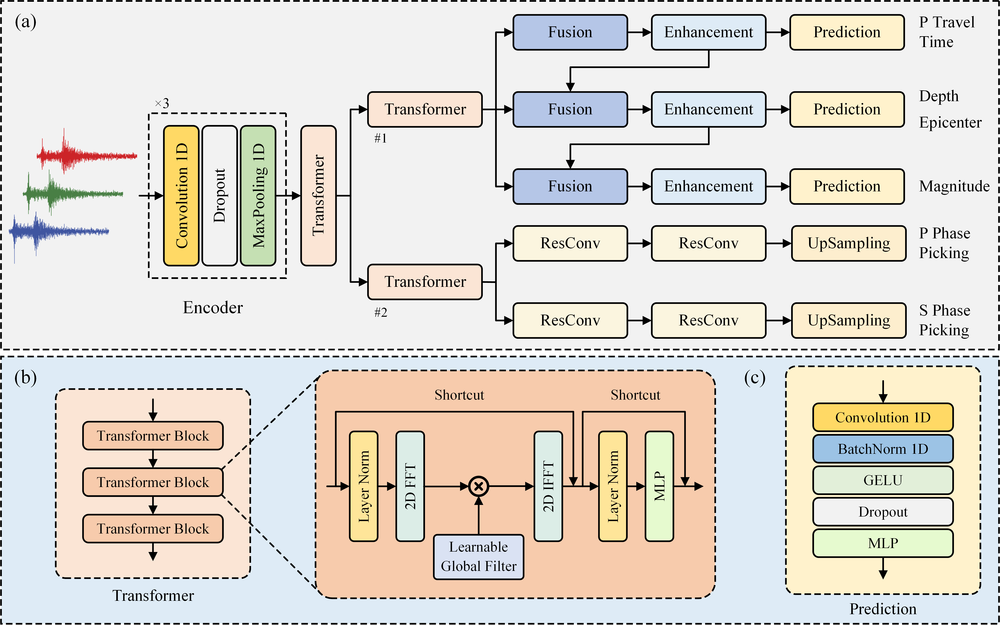

# MSEP-TFormer: A Multi-task Source Estimation Parameter Transformer Network for Earthquake Monitoring

    <a href='http://gciigroup.cn/' target='_blank'>Xingguo Huang1, *</a>&emsp;
    <a href='https://github.com/power416/' target='_blank'>Yupeng Zhang1</a>&emsp;

 

    1
    Jilin University, College of Instrumentation and Electrical Engineering, Changchun, China.

## MSEP-TFormer Architecture

  

* Run `python test.py`.

### ✨ We will subsequently release additional code.

